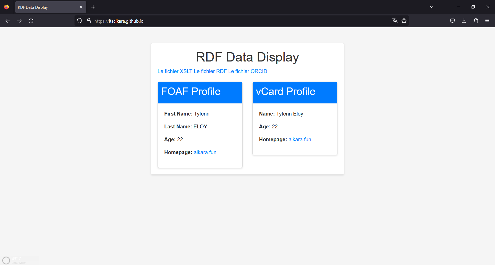
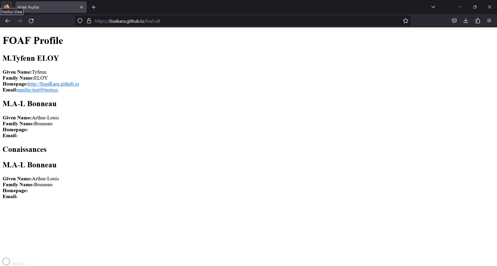
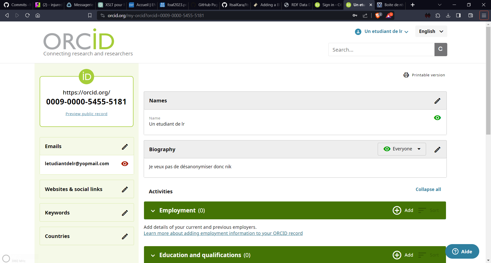

# TP 1
**/!\\ Les fichiers ne seront pas disponibles indéfiniment j'ai d'autres projet plus important à mettre en avant sur ma page github. De plus je ne souhaite pas trop exposer mon identité sur internet /!\\**
## Exercice 1
J'ai commencé par ne pas comprendre la consigne en créant un fichier html en guise de page d'acceuil (que j'ai gardé afin de laisser les différents documents acessible facilement)

Une fois cela fait j'ai crééer mon fichier RDF contenant certaines de mes informations personnelles.

J'ai ensuite validé ce fichier avec le site [RDF Validator](https://www.w3.org/RDF/Validator/)

J'ai ensuite push les fichier sur mon [github](https://github.com/ItsaiKara/ItsaiKara.github.io).

J'en ai aussi profiter pour créer la page au même moment.


*Figure 1: La page finie*


## Exercice 2
Ici nous avons commencés a rédiger le fichier xslt permettant de transformer le fichier RDF en fichier HTML plus lisible.
Nous avons cependant par soucis de temps décidé de ne pas trop pousser la mise en forme du fichier HTML.

Un problème très frustant est vite apparus:
Github met entre 1 et 5 minutes a mettre à jours le contenus de la page (oui meme en vidant le cache du navigateur).
Cela nous a fait perdre beaucoup de temps car nous ne pouvions pas voir les changements en temps réel. Et cela à été très frustrant.

Tellement que après avoir continué le TP un bug est apparus et affiche en double les connaissances pour une raison que j'ignore. 


*Figure 2: Le fichier RDF transformé en HTML disponible [ici](https://itsaikara.github.io/foaf.rdf)*

## Exercice 3
Ne souhaitant pas donner d'informations personnelles sur internet j'ai décidé de créer un compte factice pour l'exercice.


*Figure 3: Le compte factice*

Ensuite j'ai curl ces données avec la commande: 

``` curl -H -L "Accept: text/turtle" "http://pub.orcid.org/v3.0/0009-0000-5455-5181" ```

La sortie de cette commande est disponible [ici](./orcid.rdf)

Nous constatons que ce sont bien nos données personelles qui sont affichées.

Nous pourrions le transformer en HTML avec un fichier XSLT mais celà ne nous est jamais demandé.
Cependant nous avons quand même essayé de le faire mais nous avons rencontré un problème avec le namespace.

*Disponible [ici](./orcid.xslt)*

## Exercice 4
On nous demande d'utiliser un crawler pour trouver d'autres personnes foaf.

Après téléchargement de ldspider nous créons une liste de lien a parcourir. (fichier liens.txt)

Nous lançons ensuite le crawler avec la commande:

``` java -jar ldspider-1.3-with-dependencies.jar -s ./liens -o output.rdf -c 10 ```

A en juger par la sortie du programme il a trouvé quelques personnes. Car le fichier fait plus de 600 lignes

## Conclusion
Ce TP a couvert la création de fichiers RDF, la transformation en HTML avec XSLT, l'utilisation d'un crawler pour découvrir d'autres ressources FOAF, et la préservation de la confidentialité des données personnelles.
